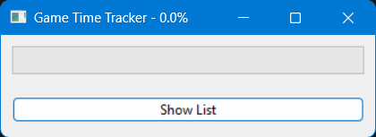
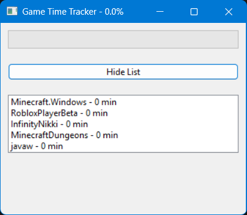

# Parental Controls: Game Time Limiter (*game_time_limiter*)

> *Application for setting a time limit for kids Windows games and applications.*

![Python version][python-version]
![Latest version][latest-version]
[![GitHub issues][issues-image]][issues-url]
[![GitHub forks][fork-image]][fork-url]
[![GitHub Stars][stars-image]][stars-url]
[![License][license-image]][license-url]

NOTE: This project was generated with [Cookiecutter](https://github.com/audreyr/cookiecutter) along with [@clamytoe's](https://github.com/clamytoe) [toepack](https://github.com/clamytoe/toepack) project template.

## Initial setup

```zsh
cd Projects
git clone https://github.com/clamytoe/game_time_limiter.git
cd game_time_limiter
```

### Anaconda setup

If you are an Anaconda user, this command will get you up to speed with the base installation.

```zsh
conda env create
conda activate game_time_limiter
```

### Regular Python setup

If you are just using normal Python, this will get you ready, but I highly recommend that you do this in a virtual environment.
There are many ways to do this, the simplest using *venv*.

```zsh
python3 -m venv venv
source venv/bin/activate
pip install -r requirements.txt
```

### Create Windows executable

```cmd
pyinstaller --onefile --windowed --icon=OGS.ico game_time_limiter.py
```

#### Windows executable notes

Once your executable is created, you can move it to wherever you like.

> **NOTE:** By default the Windows executable will look for the `gtl_config.json` and `apps_list.txt` files in the **%appdata%** directory. It will also create and store the `GaneTimeLimiter.json` log file ithere.

When you run it for the first time, it will looke like this:



If you click on the "Show List" button, you will see the list of games that are currently being monitored.



As your child plays any of the games listed:

- The progress bar will grow.
- The percentage of time used is didplayed in the title.
- When 10 minutes are left, a warning message will be displayed.
- If the time limit is reached, the game will be closed and an alert will be displayed.
- Time resets at midnight.

## Task Scheduler

I used the Windows Task Scheduler to run the executable when the user logs on to the machine.

**Game Time Limiter**:

1. **Open Task Scheduler** ( **Win + R**, type `taskschd.msc`, hit **Enter**).
2. Click **Create Task...**
3. **General Tab:**
      - Name: `Game Time Limiter`
      - Check: **Run only when user is logged on**
4. **Triggers Tab:**
      - Click **New**
      - Begin the task: **At log on**
5. **Actions Tab:**
      - Click **New**
      - Action: **Start a program**
      - Browse: *File location*
      - Start in (optional): *Same file location*
6. Click **OK**.

To prevent my kids from just closing the application, I password protected it.

> **NOTE:** If the script is ran from the command line, the password is printed to the terminal.

## Additional tools

I've provided additional scripts to help with finding what Steam and Epic Games are installed on the system, along with another to display the currently running executables.

**find_games.py**:

```zsh
> python find_games.py

[Steam]
LockdownProtocol.exe
Myst.exe
HogwartsLegacy.exe
ClearThirdParty.exe
StillWakesTheDeep.exe
Warhammer 40,000 Boltgun.exe
Wuthering Waves.exe
Riven.exe

[EpicGames]
InfinityNikki.exe
```

**active_processes.py**:

```zsh
> python active_processes.py

[Processes]
ASUS_FRQ_Control.exe
AacAmbientLighting.exe
AcPowerNotification.exe
AcrobatNotificationClient.exe
AdobeCollabSync.exe
AggregatorHost.exe
AppVShNotify.exe
AppleMobileDeviceService.exe
ApplicationFrameHost.exe
ArmouryCrate.Service.exe
ArmouryCrate.UserSessionHelper.exe
ArmouryCrate.exe
ArmouryHtmlDebugServer.exe
ArmourySocketServer.exe
ArmourySwAgent.exe
...
```

These will make it easy to populate the `apps_list.txt` file.

**apps_list.txt**:

```txt
javaw.exe
Minecraft.Windows.exe
MinecraftDungeons.exe
RobloxPlayerBeta.exe
steam.exe
```

**create_exe.bat**:

The `create_exe.bat` file will create a Windows executable from the `game_time_limiter.py` file.

```cmd
create_exe.bat
875 INFO: PyInstaller: 6.13.0, contrib hooks: 2025.4
875 INFO: Python: 3.13.3 (conda)
914 INFO: Platform: Windows-11-10.0.26100-SP0
...
25626 INFO: Copying icon to EXE
25697 INFO: Copying 0 resources to EXE
25698 INFO: Embedding manifest in EXE
25754 INFO: Appending PKG archive to EXE
25826 INFO: Fixing EXE headers
27787 INFO: Building EXE from EXE-00.toc completed successfully.
27792 INFO: Build complete! The results are available in: C:\Users\clamy\Projects\game_time_limiter\dist
```

You will find the executable in the `dist` directory.

## Contributing

Contributions are welcomed.
Tests can be run with with `pytest -v`, please ensure that all tests are passing and that you've checked your code with the following packages before submitting a pull request:

- black
- flake8
- isort
- mypy
- pytest-cov

I am not adhering to them strictly, but try to clean up what's reasonable.

## License

Distributed under the terms of the [MIT](https://opensource.org/licenses/MIT) license, "game_time_limiter" is free and open source software.

## Issues

If you encounter any problems, please [file an issue](https://github.com/clamytoe/toepack/issues) along with a detailed description.

## Changelog

- **v0.2.0** Moved configuration values outside of program.
- **v0.1.1** Modified badge url for license file from master to main branch.
- **v0.1.0** Initial commit.

[python-version]:https://img.shields.io/badge/python-3.13.3-brightgreen.svg?cacheSeconds=3600
[latest-version]:https://img.shields.io/badge/version-0.2.0-blue.svg?cacheSeconds=3600
[issues-image]:https://img.shields.io/github/issues/clamytoe/game_time_limiter.svg?cacheSeconds=3600
[issues-url]:https://github.com/clamytoe/game_time_limiter/issues
[fork-image]:https://img.shields.io/github/forks/clamytoe/game_time_limiter.svg?cacheSeconds=3600
[fork-url]:https://github.com/clamytoe/game_time_limiter/network
[stars-image]:https://img.shields.io/github/stars/clamytoe/game_time_limiter.svg?cacheSeconds=3600
[stars-url]:https://github.com/clamytoe/game_time_limiter/stargazers
[license-image]:https://img.shields.io/github/license/clamytoe/game_time_limiter.svg?cacheSeconds=3600
[license-url]:https://github.com/clamytoe/game_time_limiter/blob/main/LICENSE
